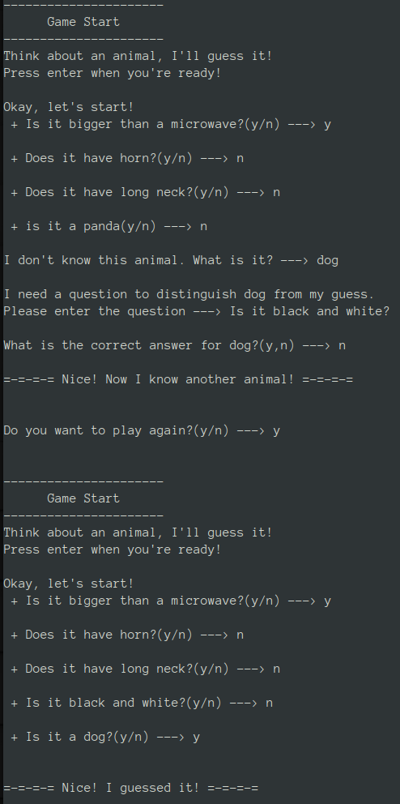

### Animal Guesing Game
> Think of an animal and this game will guess which one it is. If the game does not know that animal, it will update itself with that animal.

## Mechanic
The game saves all the animal in a binary tree where each leaf node is an animal and every other node is a yes/no question. The question from the parent
node is asked and if the answer is yes, it proceeds to ask the question of the left child. Otherwise, the question of the right child is asked. It will 
keep asking questions until the leaf node is reached which results in an animal.

## Installing
* Step 1: Download the game's source codes
* Step 2: Locate the game directory from terminal
* Step 3: To compile the game source codes:
`make all`
* Step 4: To run the game:
`./animal-guessing`

## Program Image

